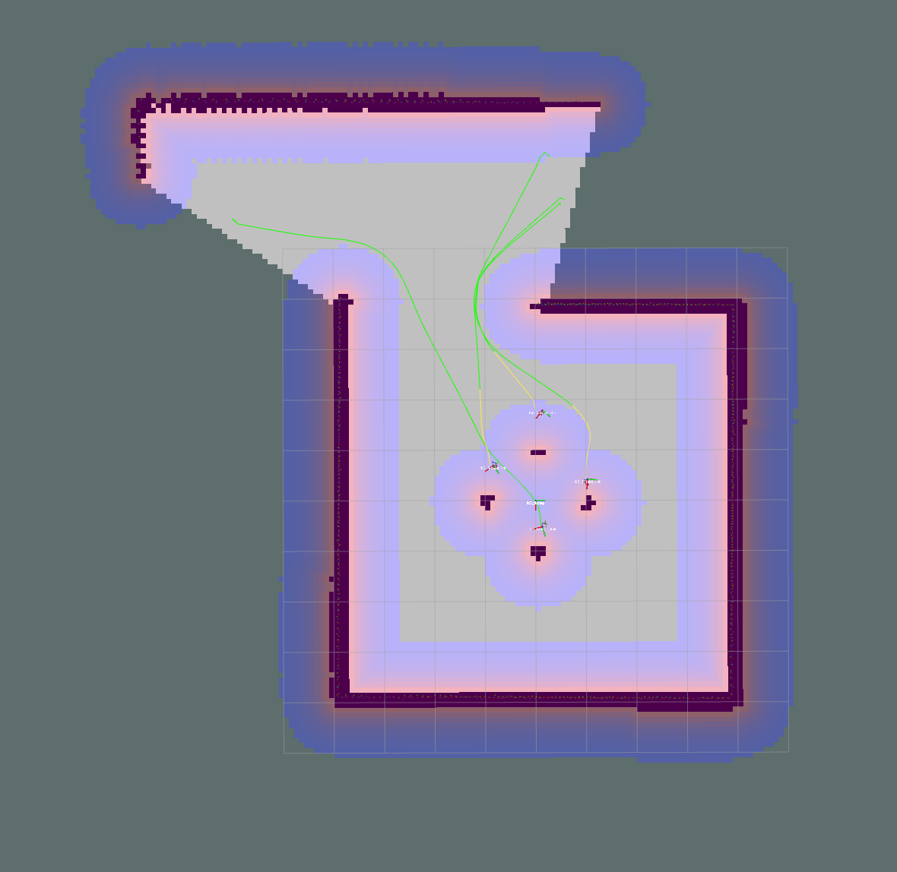
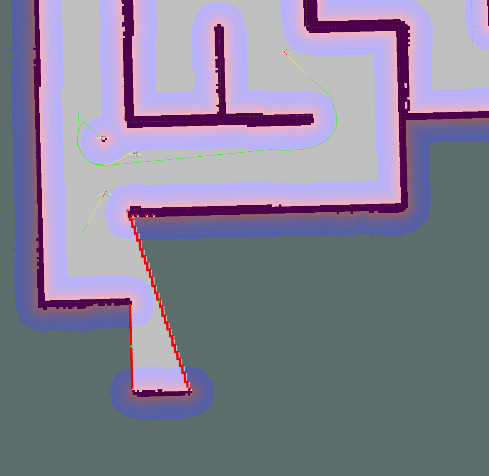
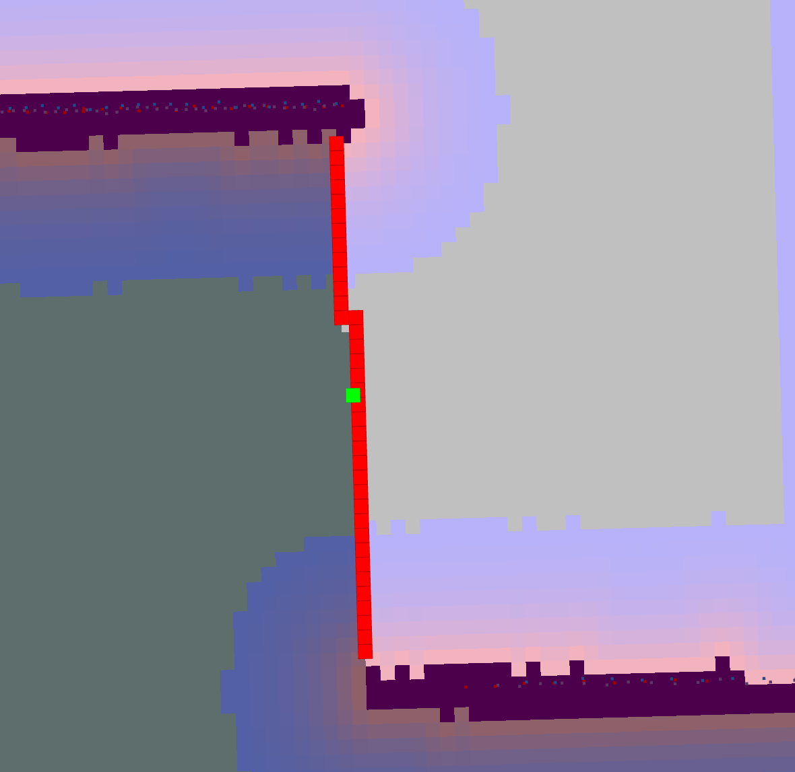
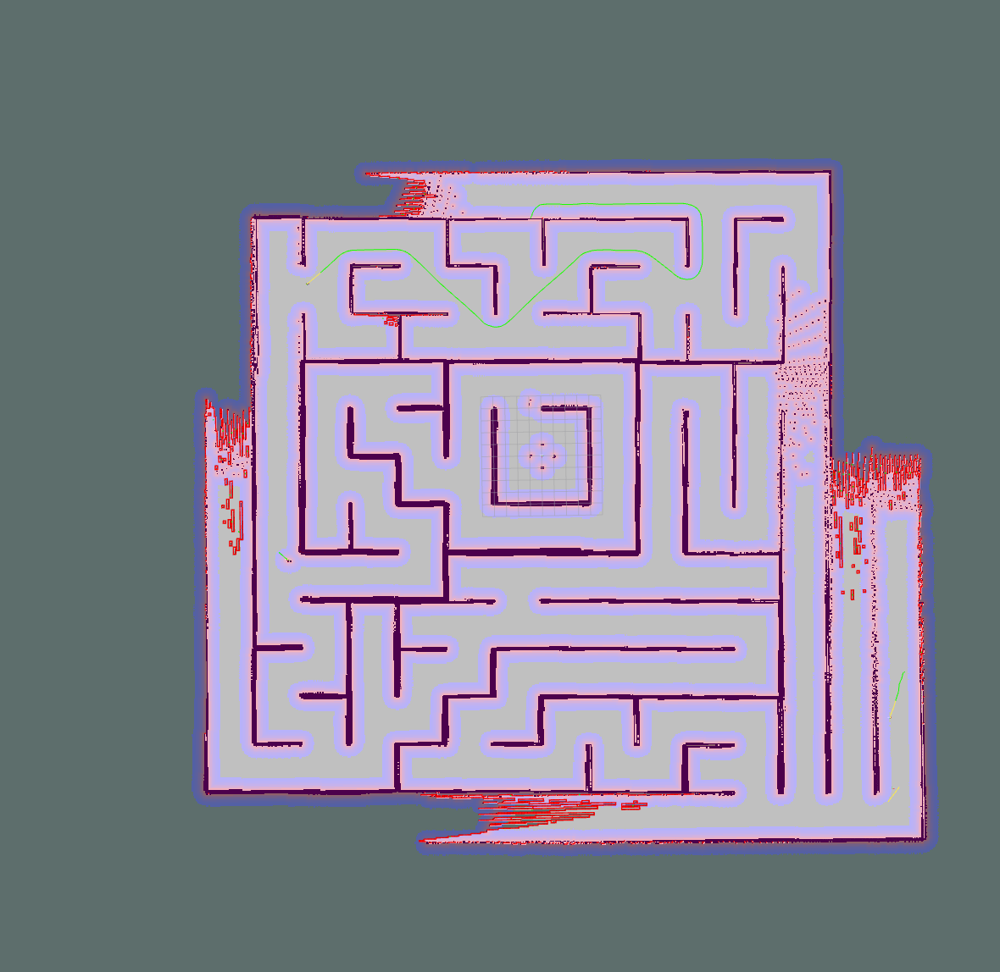

# Ödev 3

Çalıştırmak için
```
roslaunch homework3 start_exploration.launch
```
komutu çalıştırılmalıdır. Ros mesajı mantığında çalışmak içi start_exploration.launch dosyasında control_logic parametresinin değeri "topic" olmalıdır. Ros servisi mantığında çalışabilmek için ise "service" olmalıdır.  

Keşif Frontier tabanlıdır. Çıkartılan frontierler CCL ile kümelenmiştir ve ağırlıklı ortalama ile merkez noktası hesabı yapılmıştır. Kırmızı kareler frontier, yeşil kareler ise merkez hedef noktalarıdır.




