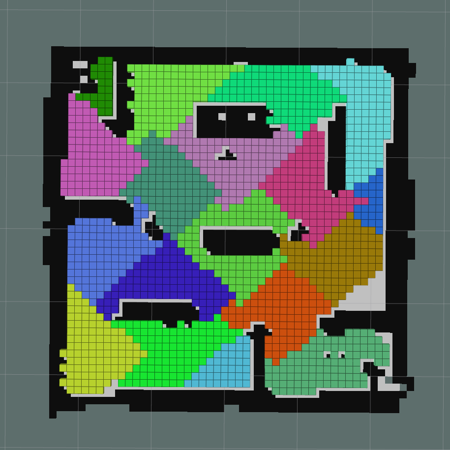
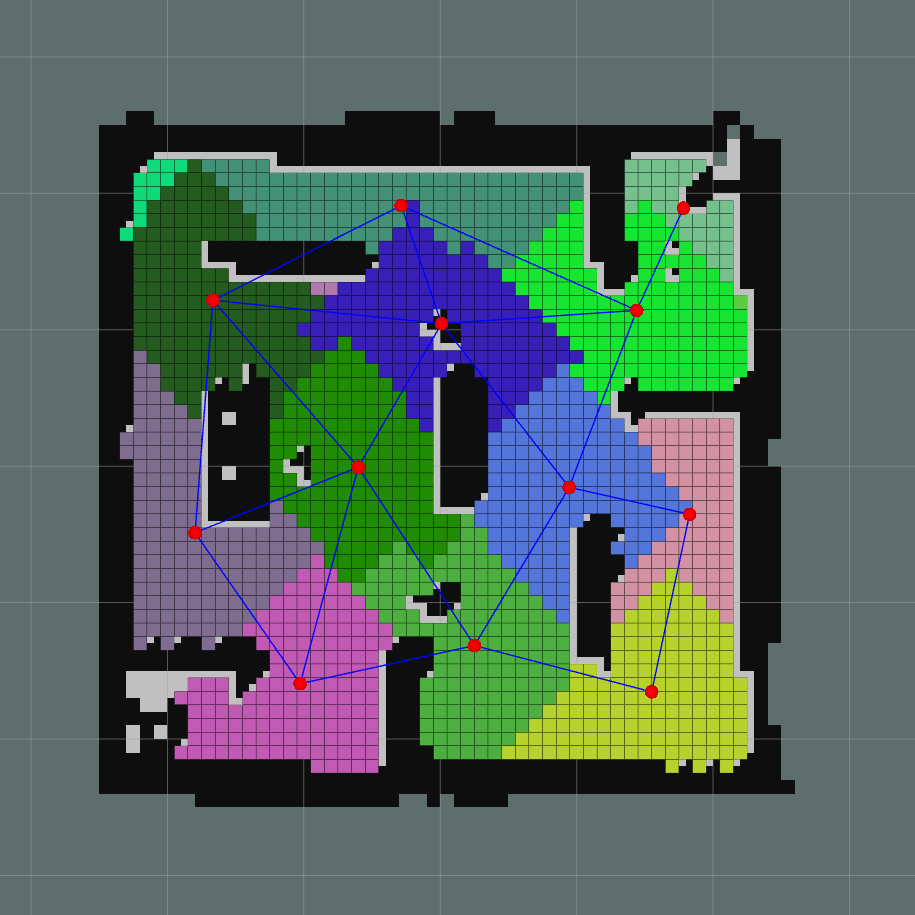
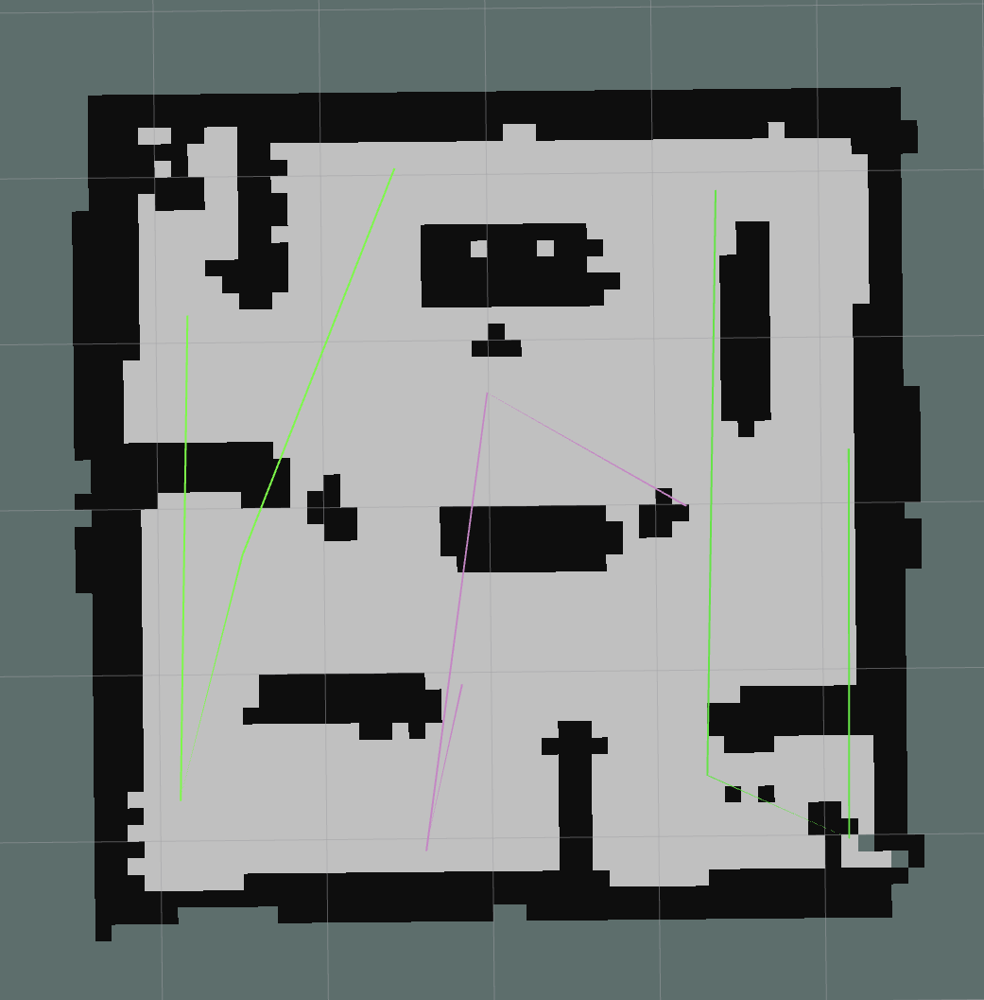
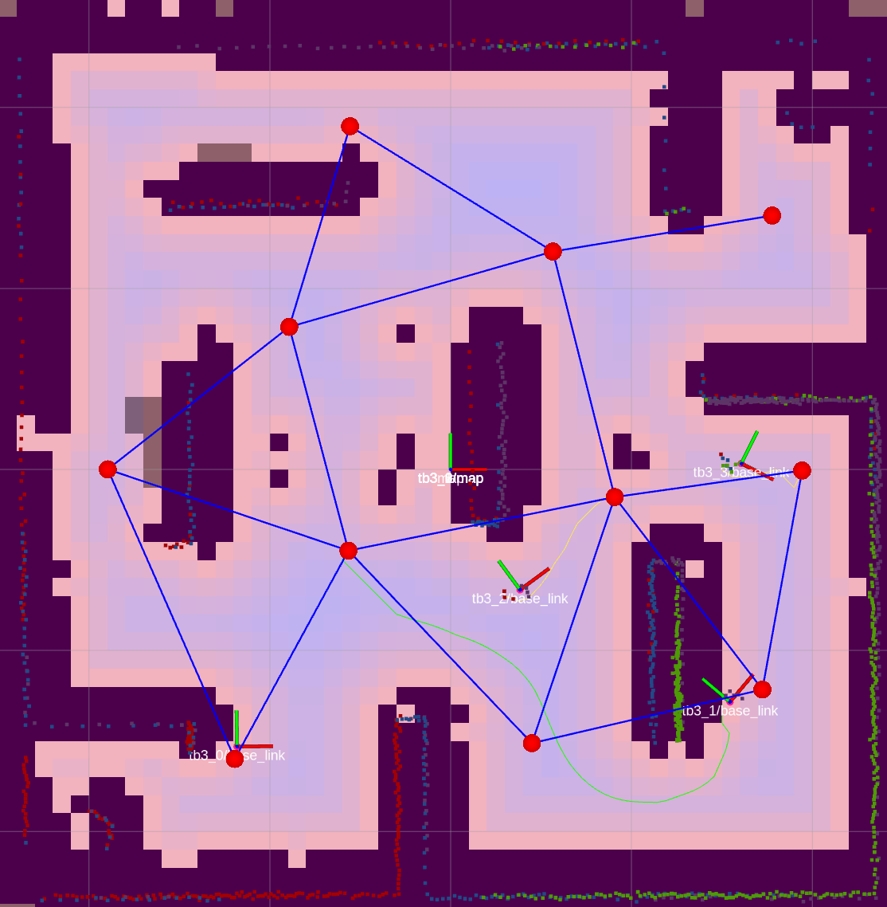
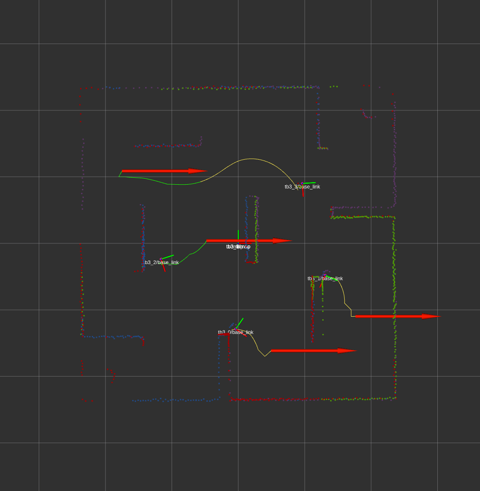

# patrol

# Tasarım

Görevin gerçeklenmesi için 2 adet program yazılmıştır. Bunlar; 

map_to_graph
- nav_msgs/OccupancyGrid haritasına abone olup hedef rotalarını çıkarmak ile sorumludur.
- Yayınlanan mesajlar
  - /segmented_map
  - /graph
  - /route
  - /tb3_{id}/path
- Dinlenen mesajlar
  - /map
- Birleştirilen harita üzerinde çalışır.
- İlk olarak gelen harita mesajı okunur ve std::vector veri tipinde tutulur.
- Elde edilen harita üzerinde segmentasyon işlemi yapılır. Amaç haritayı daha küçük birden fazla alana bölmektir. Bölme işleminde CCL (Connected-Component Labeling) algoritması kullanılmıştır. Bölme işlemi sonucunda elde edilen harita aşağıdaki gibidir.



- Bu işlemin amacı haritayı graf yapısında işleyebilmektir. Elde edilen graf üzerinde daha az maliyetli hedef üretilmesi ve bağlantılı noktaların işaretlenebilmesi hedeflenmiştir.

- Graf inşaa edilirken merkezlerin gerçek konumları hesaplanmaktadır. Graf işlemi sonucu aşağıda mevcuttur. Merkez noktalar aritmetik ortalama ile bulunmuştur.



- Graf matris yapısında tutulmuştur.
- Ardından rota hesaplama aşamasına geçilmiştir. Graf BFS (Breadth-First Search) algoritması ile gezilmiştir. Bunun amacı komşu olan noktaların birbiri ardında düşme ihtimalinin yüksek olmasıdır. Sebebi ise elde edilen son rotanın direkt olarak robot sayısına bölünerek robotlara iletilecektir. Hesaplanan rotaların 3 adet robot için görselleştirilmesi aşağıda mevcuttur. Bu hesaplanan rotalar gerçek rotalar değildir. Sadece graf üzerinde gidilecek noktalardır ve bu rotalar robotlar tarafından kullanılmak üzere yayınlanır.




navigation_loop
- Çıkarıtalan rotaların gerçeklenmesinden sorumludur.
- Yayınlanan mesajlar
  - /tb3_{id}/move_base_simple/goal
- Dinlenen mesajlar
  - /tb3_{id}/odom
  - /tb3_{id}/path
- Elde edilen rotalar nav_msgs/Path mesajı şeklinde gelmektedir. Her robot için bir thread oluşturulur ve robotlar elde ettikleri rotalar ile harekete geçerler.
- Buradaki path mesajı içerisindeki noktalar kuyruk yapısına alınır. Ardından kuyruk yapısının başındaki nokta alınır ve aynı zamanda kuyruğun sonuna eklenir. Bu sayede döngü sağlanabilmektedir.
- Kuyruktan alınan noktaya move_base gidilmektedir. Şekillerde de görüldüğü üzere gidilebilecek nokta bir engele denk gelebilmektedir. Bu problem ise hedefe varma toleransının 0.5 metre ila 1 metre aralığında ayarlanması ile çözülebilmektedir.
- Aşağıdaki görsellerde de görüldüğü üzere verilen hedefler graf noktalarıdır.






# Çalıştırma Adımları
map_to_graph node'u her 10 mesajda bir çalışacak şekilde ayarlanmıştır. Bu robotlarda rota değişmelerine sebebiyet vermektedir. Tek rota ile çalışması için kodun bir kere çalıştırılıp ardından kapatılması faydalı olacaktır. 

Program n robot ile çalışacak şekilde ayarlanmıştır. Çalıştırmak için navigation_loop.cpp ve map_to_graph.cpp dosyalarından robot sayısı düzeltilip tekrar derlenmesi gerekmektedir.

```
roslaunch micromouse_maze micromouse_maze3_multi.launch
roslaunch turtlebot3_gazebo multi_map_merge.launch
roslaunch turtlebot3_gazebo multi_turtlebot3_slam.launch
roslaunch turtlebot3_navigation multi_move_base.launch
roslaunch micromouse_maze multi_robot_rviz.launch

rosrun patrol navigation_loop
rosrun patrol map_to_graph
```