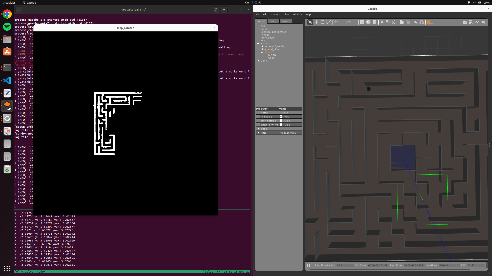
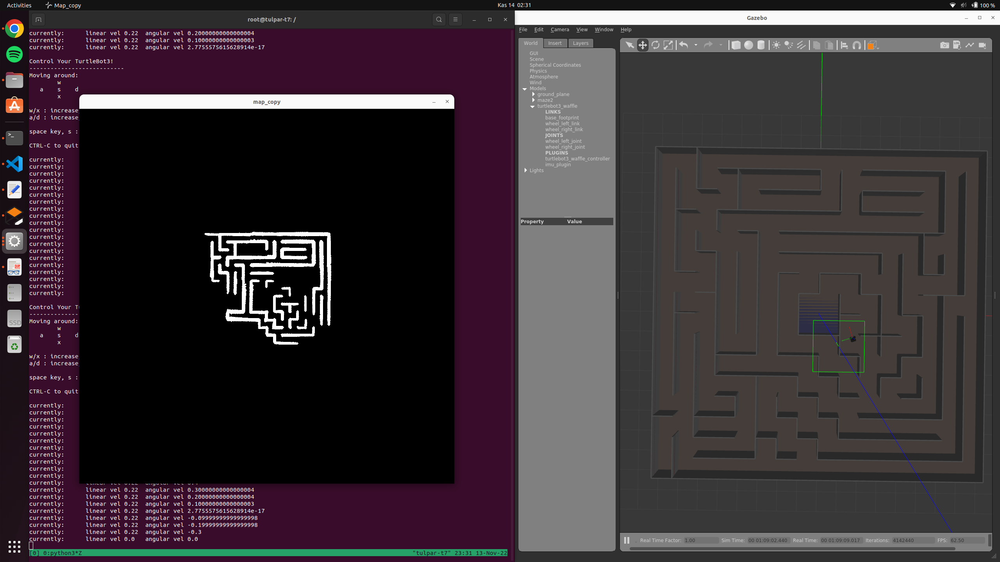

# Ödev 1

## Sistem ve gereksinimler
- Ros noetic versiyonu ubuntu 20.04 docker üzerine kuruldu.
- Sırasıyla ihtiyaç duyulan paket ve kütüphaneler: catkin(geometry_msgs roscpp rospy sensor_msgs tf), OpenCV

## Build işlemi
Kodun build edilebilmesi için adımlar
```
cd ~/robotlar_ws
catkin build
source devel/setup.bash
```

# Soru 1
İstenilen boş alanların kontrolü robotun sağ, sol ve ön tarafı olacak şekilde yapılmıştır. Ön tarafda 0.6 metre ilerisi ve yaklaşık 0.4 metre genişliğinde bir alan taraması, sağl ve sol tarafta ise 0.25 metre genişliğinde 1.2 metre uzaklığında bir alan taraması yapılmıştır. Ön taraf sadece robotoun ileriye hareketi ve duvarlardan kaçınması ile ilgilenirken, sağ ve sol taramalar ise dönülebilecek alanların kontrolünü yapmıştır. Eğer mevcut bir yol var ise bu rastgele olmak üzere kontrol edilmiştir. Kontrol aşamasında 0 ile 1 aralığında bir rastgele sayı üretilmişir. Eğer bu sayı 0.5'ten küçük ise düz devam edecek, 0.5-0.75 aralığında ise sola dönecek ve 0.75'ten büyük ise sağa dönecektir. Bu çalışmada gözlemlenen sonuç robotun sıklıkla bir rutinde takılı kalmasıdır. Hafızasız bir sistem olması sonucu ortaya çıkan bir problemdir.



5 dakika çalışması sonucu maze2'de gezilebilen alan şekildeki gibidir.
# Soru 2
OpenCV kütüphanesi ile robotun pozisyonu ve lazer taramaları kullanılarak ekrana bir harita çıkartılmıştır. expansion_factor haritanın büyüklüğünü kontrol etmektedir. Ayrıca oluşan harita açı olarak yan olduğu için döndürülerek açısı düzeltilmiştir.



